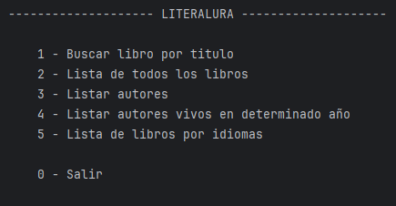
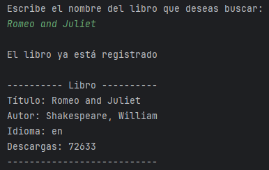
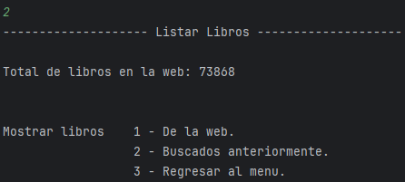
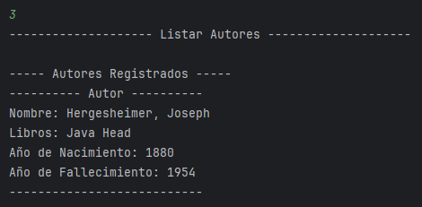
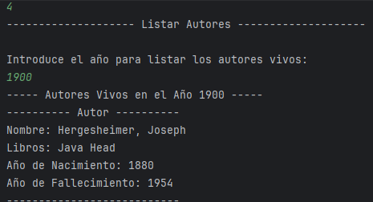
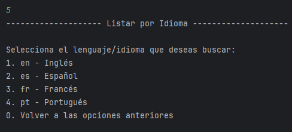

# LiterAlura

----

Proyecto LiterAlura hecho para el challenge de Alura Latam ONE.

Posee las funciones de buscar libros, listar libros, listar autores y listar libros por idiomas...

Este proyecto fue creado usando Java y IntelliJ como editor.
Como herramientas adicionales se uso Spring Boot y JPA con PostgreSQL como base de datos.

Para probar el programa, basta con abrir el proyecto en IntelliJ, configurar la base de datos dentro de `src/main/resources/application.properties`.
con eso se puede correr la aplicación.

## Capturas de pantalla del programa

----

- Menu principal.

- Buscar libro por titulo.

- Lista de libros.

- Lista de Autores.

- Lista de autores vivos en determinado año.

- Lista de libros por Idiomas.

----

*Andres Casillas @ 2024*